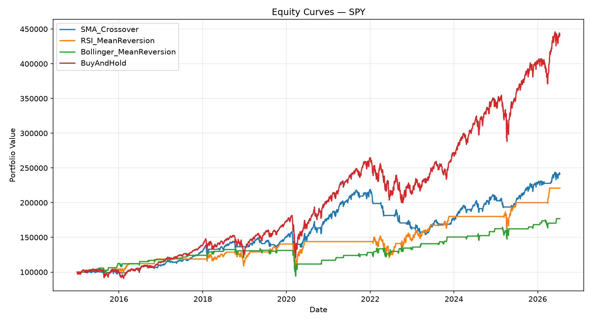
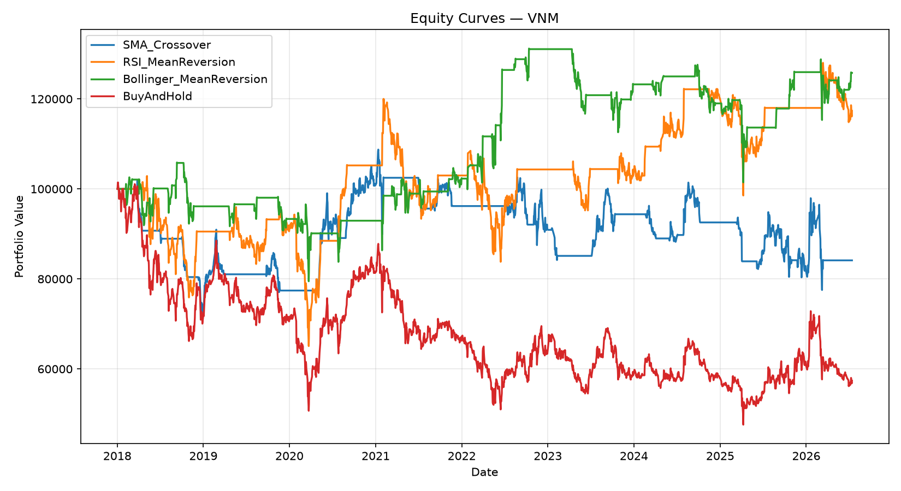
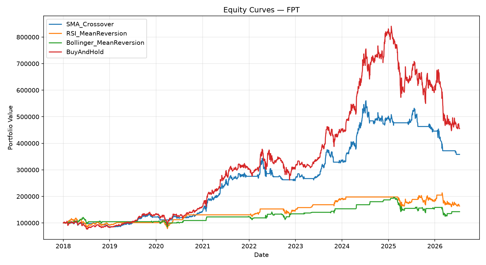

# Quant Strategy Backtesting: SMA Crossover, RSI, and Bollinger Bands

**Author:** Bao Phuc | UIT, VNU-HCM | [github.com/baorphuc](https://github.com/baorphuc)

## Overview

This project builds a Python backtesting framework to evaluate three classic
technical trading strategies — **SMA Crossover**, **RSI Mean-Reversion**, and
**Bollinger Bands Mean-Reversion** — against a **Buy & Hold** benchmark, on
three assets with distinct market regimes:

| Ticker | Market | Regime (2018–2026) |
|---|---|---|
| SPY | US (S&P 500 ETF) | Strong long-term uptrend |
| FPT | Vietnam (FPT Corp) | Strong uptrend, high volatility |
| VNM | Vietnam (Vinamilk) | Long-term decline |

Testing the same strategy logic across regimes was a deliberate design choice:
a strategy that looks good on one trending index can look very different once
applied to a declining or choppier asset. That comparison is the core finding
of this project.

## Methodology

- **Data:** Daily OHLCV, 2015–2026 (SPY) and 2018–2026 (VNM, FPT), via
  `yfinance` and `vnstock`.
- **No lookahead bias:** signals are computed from information available at
  the close of day *t*; the resulting position is only applied starting the
  *next* bar (`signal.shift(1)`), simulating "decide at today's close,
  execute tomorrow."
- **Transaction costs:** 10 bps charged on notional every time a position
  changes — this is not a frictionless backtest.
- **Position sizing:** binary full-in / full-out (0/1), no leverage, no
  partial sizing.
- **Metrics:** CAGR, Annualized Volatility, Sharpe Ratio, Sortino Ratio,
  Maximum Drawdown, Calmar Ratio, Win Rate, Number of Trades.

Strategy parameters used (defaults, not optimized per-asset):
SMA(20,50) crossover · RSI(14, 30/70) · Bollinger(20, 2σ).

## Results

### SPY (S&P 500 ETF), 2015–2026

| Strategy | CAGR | AnnVol | Sharpe | Sortino | MaxDD | Calmar | WinRate | Trades |
|---|---|---|---|---|---|---|---|---|
| Buy & Hold | **13.78%** | 17.63% | **0.82** | 1.00 | -33.72% | 0.41 | 54.9% | 1 |
| SMA Crossover | 7.96% | 11.20% | 0.74 | 0.76 | -29.60% | 0.27 | 54.5% | 53 |
| RSI Mean-Rev. | 7.14% | 14.43% | 0.55 | 0.43 | -28.41% | 0.25 | 53.4% | 24 |
| Bollinger Mean-Rev. | 5.09% | 12.60% | 0.46 | 0.25 | -29.72% | 0.17 | 50.9% | 106 |

### VNM (Vinamilk), 2018–2026

| Strategy | CAGR | AnnVol | Sharpe | Sortino | MaxDD | Calmar | WinRate | Trades |
|---|---|---|---|---|---|---|---|---|
| Buy & Hold | -6.36% | 24.50% | -0.15 | -0.22 | -53.07% | -0.12 | 47.2% | 1 |
| SMA Crossover | -2.03% | 15.82% | -0.05 | -0.05 | -29.29% | -0.07 | 48.6% | 40 |
| RSI Mean-Rev. | 1.91% | 18.43% | 0.19 | 0.23 | -36.74% | 0.05 | 46.6% | 21 |
| Bollinger Mean-Rev. | **2.75%** | 15.63% | **0.25** | 0.21 | **-24.94%** | **0.11** | 45.8% | 82 |

### FPT Corp, 2018–2026

| Strategy | CAGR | AnnVol | Sharpe | Sortino | MaxDD | Calmar | WinRate | Trades |
|---|---|---|---|---|---|---|---|---|
| Buy & Hold | **19.66%** | 27.99% | 0.78 | 1.12 | -46.84% | 0.42 | 52.2% | 1 |
| SMA Crossover | 16.31% | 20.25% | **0.85** | 0.98 | -36.08% | **0.45** | 52.5% | 38 |
| RSI Mean-Rev. | 6.02% | 19.38% | 0.40 | 0.36 | -33.88% | 0.18 | 52.4% | 19 |
| Bollinger Mean-Rev. | 4.28% | 16.53% | 0.34 | 0.23 | -36.56% | 0.12 | 48.8% | 60 |

## Key Findings

**1. Strategy effectiveness is regime-dependent, not universal.**
No single strategy wins across all three assets. Buy & Hold has the highest
Sharpe on SPY, SMA Crossover has the highest Sharpe on FPT, and Bollinger
Mean-Reversion is the only strategy with a positive CAGR on VNM. This argues
against reporting a single backtest result as "proof" that a strategy works,
and for testing across multiple regimes before drawing conclusions.

**2. On a declining asset, timing strategies preserve capital that Buy & Hold does not.**
VNM lost 6.36% CAGR annually under Buy & Hold (Sharpe -0.15, max drawdown
-53%). All three timing strategies avoided most of this decline — Bollinger
Mean-Reversion turned the same eight years into a positive 2.75% CAGR with
roughly half the drawdown (-24.9% vs -53.1%). The value of a timing strategy
here isn't beating a rising market — it's avoiding a falling one.

**3. On a trending asset, Sharpe Ratio and CAGR can point in different directions.**
On FPT, SMA Crossover produced a *lower* CAGR than Buy & Hold (16.31% vs
19.66%) but a *higher* Sharpe Ratio (0.85 vs 0.78) and better Calmar Ratio
(0.45 vs 0.42), because it cut both annualized volatility (20.3% vs 28.0%)
and max drawdown (-36.1% vs -46.8%). Judging a strategy purely on absolute
return would have missed this — it took less risk to earn most of the same
return.

**4. Trade frequency has a direct, visible cost.**
Bollinger Mean-Reversion generated 60–106 trades across the three assets —
2–3x more than SMA or RSI — and was consistently the weakest performer on
trending assets (SPY, FPT) despite reasonable win rates. At 10 bps per
trade, high-frequency mean-reversion signals pay a meaningful cost drag that
a low-turnover trend-following strategy avoids.

## Limitations

- Single-asset backtests; no portfolio-level allocation or diversification
  effects were tested.
- Position sizing is binary (full-in/full-out); no volatility-adjusted or
  risk-parity sizing.
- Strategy parameters (SMA 20/50, RSI 14/30/70, Bollinger 20/2σ) are fixed
  defaults, not optimized per asset — a `optimizer.py` module supports
  train/test grid search, but per-asset tuning was intentionally left out of
  this comparison to keep it apples-to-apples.
- 10 bps transaction cost is an estimate; real VN market costs (spread +
  fees) may run higher, which would further penalize high-turnover
  strategies like Bollinger.
- No slippage or market-impact modeling.

## Tech Stack

Python · Pandas · NumPy · Matplotlib · yfinance · vnstock
